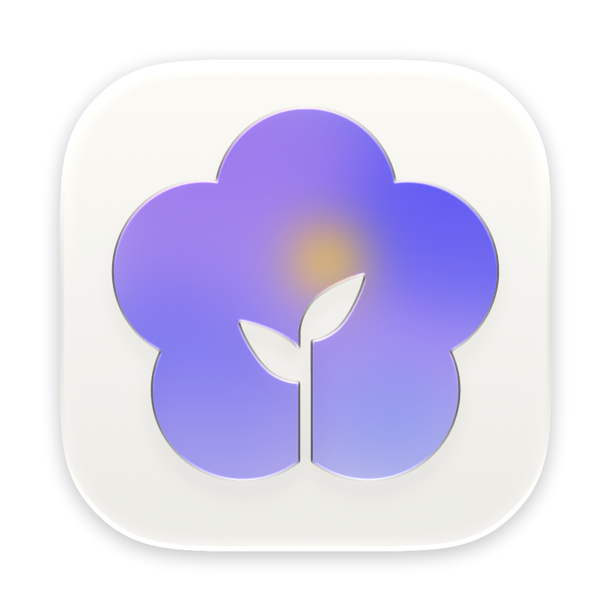

<div align="center">
  
  <h1><b>Sumi</b></h1>
  <p>
    Sumi is a native macOS browser built on WebKit and SwiftUI—organized around vertical tabs,
    spaces, and profiles so browsing stays structured without heavy chrome.
    <br>
  </p>
</div>

<p align="center">
  <a href="https://www.apple.com/macos/"></a>
  <a href="https://swift.org/"></a>
  <a href="https://www.gnu.org/licenses/gpl-3.0.html"></a>
</p>

## Project status

This tree is primarily a **development and testbed** checkout: debugging is ongoing, behaviors and APIs may change, and not everything here is polished end-user packaging. Treat builds as **experimental** unless you are contributing or validating a specific change.

Design goals stay **simple, fast, and deliberately anti-bloat**—fewer nested surfaces than mainstream browsers, with keyboard-first shortcuts and a lightweight chrome footprint where we can keep it.

## Acknowledgments

- **Zen Browser** informs the **workspace / vertical-tab mental model** and the overall “sidebar-first, low chrome” posture Sumi chases—especially how Essentials-style pinning coexists with dense tab lists.
- The codebase **started from the open-source Nook browser** but has been **heavily reworked** toward Sumi’s goals; treat today’s architecture and features as Sumi-first, not a drop-in Nook fork.
- A few **AppKit / WebKit helpers** (notably around **find-in-page** and related window chrome) **adapt code published by DuckDuckGo** for macOS under the **Apache License 2.0**—those files retain DDG copyright/SPDX headers. They are an implementation reference for specific subsystems, not an endorsement or full UI parity.

## Project Structure

Paths below are relative to the repository root (clone this repo and open `Sumi.xcodeproj` here).

```
.
├── Sumi.xcodeproj          # Xcode project for the Sumi target and tests
├── App/                     # Entry point (@main), window/content shell, commands
├── Sumi/                    # Primary app target (most SwiftUI and services)
│   ├── Managers/            # BrowserManager, TabManager, ExtensionManager, …
│   ├── Models/              # Tab, Space, Profile, BrowserConfig, …
│   ├── Components/          # SwiftUI UI (Sidebar, Browser, Settings, Peek, …)
│   ├── Services/            # Cross-cutting services (routing, diagnostics, …)
│   ├── Theme/               # Theming and chrome styling
│   ├── Utils/               # Helpers, WebKit wrappers, shaders, …
│   ├── Resources/           # Bundled scripts and related assets
│   └── …                    # Protocols, Extensions, Diagnostics, …
├── Navigation/              # Sidebar navigation helpers used by the shell
├── Onboarding/              # First-run / onboarding flows
├── CommandPalette/          # Command palette UI and accessories
├── UI/                      # Shared lightweight UI helpers
├── Settings/                # Settings-related helpers at target boundaries
├── SumiTests/               # Unit tests
├── SumiUITests/             # UI tests
├── assets/                  # README and marketing assets (e.g. icon)
├── docs/                    # Architecture and internal notes
├── scripts/                 # Development scripts
└── .github/                 # CI and GitHub metadata
```

Notable areas inside `Sumi/Components/` include **FindInPage** (in-page search) alongside Sidebar, Browser, Settings, Extensions, and related modules.

---

### Licenses

Sumi is intended to be used under the **GNU General Public License v3.0**. See the [full license text](https://www.gnu.org/licenses/gpl-3.0.html).

Some files incorporate or adapt third-party code; those portions are identified in the relevant source headers (and in any README shipped with vendored subtrees, if present). Third-party licenses apply only to those portions.
