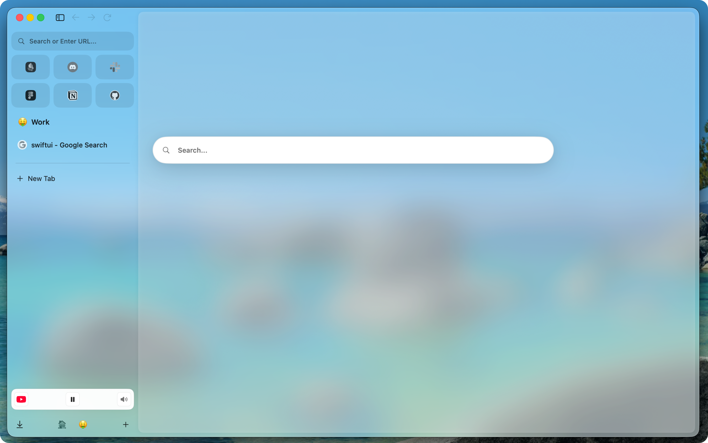

<div align="center">
  
  <h1><b>Sumi Browser</b></h1>
  <p>
    Sumi Browser is a native performance-first macOS browser.
    <br>
    It is built with WebKit and SwiftUI for users who like workspace-oriented browsers
    such as Arc and Zen, but want a leaner native macOS app with optional modules.
  </p>
</div>

<p align="center">
  <a href="https://www.apple.com/macos/"></a>
  <a href="https://swift.org/"></a>
  <a href="https://www.gnu.org/licenses/gpl-3.0.html"></a>
  
</p>

## Status

Sumi is in alpha. The browser shell builds and runs locally, but it is not recommended as a primary browser yet.

Alpha hardening is focused on the remaining user-safety pieces:

- Safari password-manager extension compatibility.

Completed user-safety pieces:

- [x] Arc/Zen import and Sumi backup/restore through Settings > Data & Recovery.
- [x] Sparkle-based Alpha update flow with GitHub Releases and static appcast infrastructure.

See [docs/roadmap.md](docs/roadmap.md) for the current Alpha status and planned work.

Alpha update and release documentation:

- [Alpha install and update behavior](docs/UPDATES.md)
- [Maintainer release process](docs/RELEASES.md)

A short Alpha demo video is available on [YouTube](https://youtu.be/7Wl-LCqUWbQ).



## What Sumi Is

Sumi is an independent open-source macOS browser. It is not a commercial product, not an AI browser, and not an attempt to replace Chromium for every use case.

The project focuses on:

- Native macOS behavior through Swift, SwiftUI, AppKit where appropriate, and system WebKit.
- Arc/Zen-style organization without cloning either project.
- A performance-first browser shell with tabs, spaces, profiles, Glance, split view, and sidebar organization.
- Optional extension, userscript, and privacy-cleanup modules that should not impose background runtime cost when disabled.
- User-controlled features instead of always-on product surfaces.

## Working Browser Features

Current Alpha builds include:

- Native macOS browser shell using WebKit and SwiftUI.
- Tabs, sidebar, profiles, and spaces.
- Essentials, pinned items, nested folders, and drag-and-drop sidebar organization.
- Essentials shared across spaces that belong to the same profile.
- Pinned items that live in a single space and appear like normal tabs.
- Pinned and essential items that keep their visible sidebar identity while the live WebView/runtime instance is unloaded to reduce memory use.
- Glance, which opens over the current tab or from pinned, essential, and launcher-style items, closes quickly, can expand into a normal tab, and can move into split view.
- Split view with up to four views.
- Incognito windows backed by an ephemeral profile and ephemeral tabs.
- Floating bar search/address field with suggestions, site search, history suggestions, bookmark suggestions, compact/top links behavior, and split-aware actions.
- Bookmarks, history, and search inside bookmarks, history, and settings.
- Custom themes.
- Data & Recovery settings for Arc and Zen import with nested folder hierarchy, browser2zen-compatible `.sumiexport` transfer files, bookmarks import from Chrome/Safari/Firefox, and logical Sumi `.sumibackup` backup/restore.
- Session restore setting for restoring the previous session or starting clean.
- Mini Player at the bottom of the sidebar for jumping to playing media, pausing media, and muting media.
- Memory modes and inactive tab unloading that preserve visible organization after a live WebView/runtime instance is unloaded.
- Automatic history/site-data cleanup modules.

## Extensions And Safari

Safari Extension compatibility is the active engineering milestone. Sumi is targeting Safari Extensions because they are supported natively by WebKit and match the project's performance and energy goals.

The current direction is:

- Safari extensions on top of `WKWebExtensions`.
- Current installation paths for development: scanning and importing installed `.app` / `.appex` extensions.
- Near-term validation target: real-world password-manager extensions.

Sumi does not currently claim that Bitwarden, Proton Pass, 1Password, or other password managers work. The near-term target is that a user can import Safari password-manager extensions and use them from the browser UI.

See [docs/SumiSafariExtensionCompatibility.md](docs/SumiSafariExtensionCompatibility.md) for the current capability and status summary.

## Architecture Principles

Sumi WebKit is a native macOS application. The current target is macOS 15.7+.

The project prefers:

- System WebKit for page rendering.
- SwiftUI and AppKit for native browser chrome and platform integration.
- Native platform surfaces over heavy web/JavaScript-based browser UI where possible.
- Lazy optional modules and no runtime work when a module is disabled.
- Avoiding background services, timers, and long-running tasks unless they are necessary and visible in the product design.
- Extension-based AI tools later, once extension compatibility matures, instead of a built-in AI panel.

The high-level architecture notes live in [docs/architecture.md](docs/architecture.md).

## Roadmap Summary

Near-term work:

- Safari password-manager extension compatibility.

Later work under consideration:

- Live folders.
- Site customization/boosts.
- Fully encrypted sync without data collection.
- Multi-window workflows.
- Improved profile isolation.
- Deeper direct Safari and Chrome import beyond bookmarks and portable transfer files.

## Project Structure

Paths below are relative to the repository root.

```text
.
├── Sumi.xcodeproj          # Xcode project for the Sumi target and tests
├── App/                    # Entry point, window/content shell, commands
├── Sumi/                   # Primary app target
│   ├── Managers/           # BrowserManager, TabManager, ExtensionManager, ...
│   ├── Models/             # Tab, Space, Profile, BrowserConfig, ...
│   ├── Components/         # SwiftUI UI: Sidebar, Browser, Settings, Glance, ...
│   ├── Services/           # Cross-cutting services
│   ├── Theme/              # Theming and chrome styling
│   ├── Utils/              # Helpers and WebKit wrappers
│   └── Resources/          # Bundled scripts and related assets
├── FloatingBar/            # Floating bar UI and accessories
├── Navigation/             # Sidebar navigation helpers
├── Settings/               # Settings-related helpers
├── UI/                     # Shared lightweight UI helpers
├── Vendor/                 # Vendored third-party components
├── SumiTests/              # Unit tests
├── SumiUITests/            # UI tests
├── assets/                 # Logo and public visual assets
├── docs/                   # Public and maintainer documentation
└── scripts/                # Development scripts
```

Some maintainer-only docs and local artifacts may exist in a full checkout, but public documentation under `docs/` is intended to be tracked.

## Contributing

Sumi is experimental. Contributions should preserve the native macOS/WebKit direction, performance-first design, optional module boundaries, and honest status of incomplete features.

See [CONTRIBUTING.md](CONTRIBUTING.md).

## License And Attribution

Sumi is licensed under the GNU General Public License v3.0. See [LICENSE](LICENSE).

The project is independent, but it was not written entirely from scratch. The codebase started from the open-source Nook browser and has been heavily reworked toward Sumi's goals. Sumi also includes vendored or adapted open-source components from DuckDuckGo's Apple browser projects, including BrowserServicesKit and URLPredictor, under their applicable licenses.

The Arc/Zen migration work is compatible with [browser2zen](https://github.com/tarikbc/browser2zen) export data and was informed by that project's public MIT-licensed behavior and schema shape. Sumi does not vendor browser2zen or arc2zen code and does not add a Python/runtime dependency on them.

See [NOTICE.md](NOTICE.md) for attribution and affiliation details.
