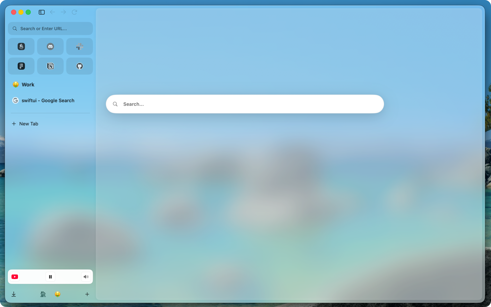

<div align="center">
  
  <h1><b>Sumi Browser</b></h1>
  <p>
    Sumi Browser is a native performance-first macOS browser.
    <br>
    It is built with WebKit and SwiftUI for users who like workspace-oriented browsers
    such as Arc and Zen, but want a leaner native macOS app with optional modules.
  </p>
</div>

<p align="center">
  <a href="https://www.apple.com/macos/"></a>
  <a href="https://swift.org/"></a>
  
  <a href="https://www.gnu.org/licenses/gpl-3.0.html"></a>
  
</p>

<p align="center">
  <a href="https://github.com/FedyaLight/sumi-webkit/actions/workflows/sumi-ci.yml"></a>
  <a href="https://github.com/FedyaLight/sumi-webkit/actions/workflows/architecture-guardrails.yml"></a>
</p>

## Status

Sumi is in alpha. The browser shell builds and runs locally, but it is not recommended as a primary browser yet.

Alpha hardening is focused on the remaining user-safety pieces:

- Safari password-manager extension compatibility.

Completed user-safety pieces:

- [x] Arc/Zen import and Sumi backup/restore through Settings > Data & Recovery.
- [x] Sparkle-based Alpha update flow with GitHub Releases and static appcast infrastructure.

See [docs/roadmap.md](docs/roadmap.md) for the current Alpha status and planned work.

Alpha update and release documentation:

- [Alpha install and update behavior](docs/UPDATES.md)
- [Maintainer release process](docs/RELEASES.md)

## Demo

A short [Alpha demo video](https://youtu.be/7Wl-LCqUWbQ) shows the browser shell,
sidebar organization, Glance, split view, the command palette, and memory-oriented
runtime behavior.

[](https://youtu.be/7Wl-LCqUWbQ)

## What Sumi Is

Sumi is an independent open-source macOS browser. It is not a commercial product, not an AI browser, and not an attempt to replace Chromium for every use case.

The project focuses on:

- Native macOS behavior through Swift, SwiftUI, AppKit where appropriate, and system WebKit.
- Arc/Zen-style organization without cloning either project.
- A performance-first browser shell with tabs, spaces, profiles, Glance, split view, and sidebar organization.
- Optional extension, customization, and privacy-cleanup modules that should not impose background runtime cost when disabled.
- User-controlled features instead of always-on product surfaces.

## Scope And WebKit Boundary

Sumi implements the **browser application layer**. It does not implement a
browser engine.

| Sumi owns in this repository | System WebKit owns |
| --- | --- |
| Native SwiftUI/AppKit browser chrome | HTML and CSS parsing and rendering |
| Tabs, spaces, profiles, Glance, split view, and window behavior | JavaScript execution |
| `WKWebView` creation, placement, lifecycle, and product-level navigation coordination | Web content, networking, and rendering processes |
| Browser persistence, recovery, permissions UX, and update integration | Web platform implementation and process sandboxing |
| Extension management and compatibility bridges around WebKit APIs | The underlying `WKWebExtension` and `WKWebView` runtime |

The detailed ownership and module map lives in
[docs/architecture.md](docs/architecture.md).

## Build And Run

### Requirements

- macOS 15.5 or newer.
- Xcode 27 preview, matching the repository-owned CI toolchain manifest.
- Apple Silicon for the currently validated build, test, and Alpha packaging
  path. Intel is not a claimed release target.

The project uses the Swift 6 language mode. The compiler version selected by
the current Xcode 27 preview toolchain is reported by CI and may advance while
the preview runner is updated.

### Open In Xcode

```sh
git clone https://github.com/FedyaLight/sumi-webkit.git
cd sumi-webkit
xcodebuild -resolvePackageDependencies -project Sumi.xcodeproj -scheme Sumi
open Sumi.xcodeproj
```

Select the `Sumi` scheme and run the app. If Xcode cannot use the development
team stored in the project, select your own team under **Signing &
Capabilities** for the local checkout. Do not commit that local signing change.

### Verify The Checkout

```sh
# Text, shell, JSON, and CI-manifest validation
scripts/ci/preflight.sh fast

# Fast checks plus all portable architecture guardrails
scripts/ci/preflight.sh portable

# Portable checks plus the complete PR test profile; requires Xcode 27
scripts/ci/preflight.sh full
```

The CI manifest is the source of truth for package tests, app-test roles,
Xcode schemes, and toolchain selection. To inspect the live test inventory:

```sh
scripts/ci/run_tests.sh inventory
```

## Working Browser Features

Current Alpha builds include:

- Native macOS browser shell using WebKit and SwiftUI.
- Tabs, sidebar, profiles, and spaces.
- Essentials, pinned items, nested folders, and drag-and-drop sidebar organization.
- Essentials shared across spaces that belong to the same profile.
- Pinned items that live in a single space and appear like normal tabs.
- Pinned and essential items that keep their visible sidebar identity while the live WebView/runtime instance is unloaded to reduce memory use.
- Glance, which opens over the current tab or from pinned, essential, and launcher-style items, closes quickly, can expand into a normal tab, and can move into split view.
- Split view with up to four views.
- Incognito windows backed by an ephemeral profile and ephemeral tabs.
- Command palette search/address field with contextual local results, site search, history and bookmark suggestions, and split-aware actions.
- Bookmarks, history, and search inside bookmarks, history, and settings.
- Custom themes.
- Data & Recovery settings for Arc and Zen import with nested folder hierarchy, browser2zen-compatible `.sumiexport` transfer files, bookmarks import from Chrome/Safari/Firefox, and logical Sumi `.sumibackup` backup/restore.
- Session restore setting for restoring the previous session or starting clean.
- Mini Player at the bottom of the sidebar for jumping to playing media, pausing media, and muting media.
- Memory modes and inactive tab unloading that preserve visible organization after a live WebView/runtime instance is unloaded.
- Manual Tracking Protection and Adblock levels backed by prepared WebKit content-rule bundles from `sumi-protection-bundles`; the browser does not fetch raw filter lists or generate rules at runtime.
- Automatic history/site-data cleanup modules.

## Extensions And Safari

Safari Extension compatibility is the active engineering milestone. Sumi is targeting Safari Extensions because they are supported natively by WebKit and match the project's performance and energy goals.

The current direction is:

- Safari extensions on top of `WKWebExtensions`.
- Current installation paths for development: scanning and importing installed `.app` / `.appex` extensions.
- Near-term validation target: real-world password-manager extensions.

Sumi does not currently claim that Bitwarden, Proton Pass, 1Password, or other password managers work. The near-term target is that a user can import Safari password-manager extensions and use them from the browser UI.

See [docs/SumiSafariExtensionCompatibility.md](docs/SumiSafariExtensionCompatibility.md) for the current capability and status summary.

## Architecture Principles

Sumi WebKit is a native macOS application. The current target is macOS 15.5+.

The project prefers:

- System WebKit for page rendering.
- SwiftUI and AppKit for native browser chrome and platform integration.
- Native platform surfaces over heavy web/JavaScript-based browser UI where possible.
- Lazy optional modules and no runtime work when a module is disabled.
- Avoiding background services, timers, and long-running tasks unless they are necessary and visible in the product design.
- Extension-based AI tools later, once extension compatibility matures, instead of a built-in AI panel.

The high-level architecture notes live in [docs/architecture.md](docs/architecture.md).

## Verification And Performance Work

Pull requests run independent lanes for the `SumiDomain` and `SumiWebRuntime`
packages plus app-test shards covering pure policy, persistence and migration,
UI-free services, and WebKit-heavy behavior. Nightly validation additionally
owns the exhaustive app inventory and UI launch smoke.

`Performance-first` is a design constraint, not an unqualified claim that Sumi
outperforms another browser. The repository includes a repeatable unsigned
Debug/Release regression harness and documented Instruments scenarios:

```sh
scripts/run_perf_regression.sh verify
```

See [docs/performance-profiling.md](docs/performance-profiling.md) for trace
templates, signposts, and manual comparison requirements. Comparative numbers
should only be published together with their fixtures, hardware, OS, and
reproduction method.

## Roadmap Summary

Near-term work:

- Safari password-manager extension compatibility.

Later work under consideration:

- Live folders.
- Site customization/boosts.
- Fully encrypted sync without data collection.
- Multi-window workflows.
- Improved profile isolation.
- Deeper direct Safari and Chrome import beyond bookmarks and portable transfer files.

## Project Structure

Paths below are relative to the repository root.

```text
.
├── Sumi.xcodeproj          # Xcode project for the Sumi target and tests
├── App/                    # Entry point, window/content shell, commands
├── Sumi/                   # Primary app target
│   ├── Managers/           # BrowserManager, TabManager, ExtensionManager, ...
│   ├── Models/             # Tab, Space, Profile, BrowserConfig, ...
│   ├── Components/         # SwiftUI UI: Sidebar, Browser, Settings, Glance, ...
│   ├── Services/           # Cross-cutting services
│   ├── Theme/              # Theming and chrome styling
│   ├── Utils/              # Helpers and WebKit wrappers
│   └── Resources/          # Bundled scripts and related assets
├── CommandPalette/            # Command palette UI and accessories
├── SidebarChrome/          # Sidebar chrome (spaces sidebar shell)
├── Settings/               # Settings-related helpers
├── UI/                     # Shared lightweight UI helpers
├── Vendor/                 # Vendored third-party components
├── SumiTests/              # Unit tests
├── SumiUITests/            # UI tests
├── assets/                 # Logo and public visual assets
├── docs/                   # Public and maintainer documentation
└── scripts/                # Development scripts
```

Some maintainer-only docs and local artifacts may exist in a full checkout, but public documentation under `docs/` is intended to be tracked.

## Contributing

Sumi is experimental. Contributions should preserve the native macOS/WebKit direction, performance-first design, optional module boundaries, and honest status of incomplete features.

See [CONTRIBUTING.md](CONTRIBUTING.md).

## License And Attribution

Sumi is licensed under the GNU General Public License v3.0. See [LICENSE](LICENSE).

The project is independent, but it was not written entirely from scratch. The codebase started from the open-source Nook browser and has been heavily reworked toward Sumi's goals. Sumi also includes vendored or adapted open-source components from DuckDuckGo's Apple browser projects, including BrowserServicesKit and URLPredictor, under their applicable licenses.

Sumi's prepared protection bundles are generated outside the browser in [`FedyaLight/sumi-protection-bundles`](https://github.com/FedyaLight/sumi-protection-bundles). The tracking-protection group is derived from DuckDuckGo Tracker Radar / Tracker Data Set metadata under CC BY-NC-SA 4.0 terms. The adblock groups are generated from source lists such as AdGuard and uBlock filter lists; their upstream source-list terms remain separate and are tracked through bundle manifests/source metadata.

The Arc/Zen migration work is compatible with [browser2zen](https://github.com/tarikbc/browser2zen) export data and was informed by that project's public MIT-licensed behavior and schema shape. Sumi does not vendor browser2zen or arc2zen code and does not add a Python/runtime dependency on them.

See [NOTICE.md](NOTICE.md) for attribution and affiliation details.

### Code Provenance At A Glance

| Area | Provenance |
| --- | --- |
| Repository foundation | Started from the GPL-licensed Nook browser and subsequently reworked around Sumi's product and architecture goals. |
| Current Sumi-specific product and runtime architecture | Developed in this repository; line-level upstream notices remain authoritative where code was retained or adapted. |
| `Vendor/DDG/BrowserServicesKit` | Pinned DuckDuckGo snapshot containing only the `Common` and `Navigation` source targets. |
| Bookmark import/storage and persistent-container helpers | Ported or adapted from Apache-2.0 DuckDuckGo sources with notices retained in the affected files. |
| Permission implementation, UI, and tests | Sumi-owned except for the explicitly documented adapted geolocation ABI header. |
| Protection rule data | Prepared outside the app from attributed upstream datasets and filter lists; source terms are recorded in bundle metadata. |

The complete attribution and copied/adapted-code inventory is maintained in
[NOTICE.md](NOTICE.md), [LICENSE_NOTES.md](LICENSE_NOTES.md),
[Vendor/DDG/README.md](Vendor/DDG/README.md), and
[docs/permissions/LICENSE_NOTES.md](docs/permissions/LICENSE_NOTES.md).
