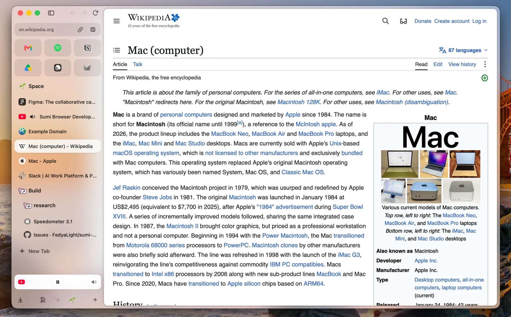

<div align="center">
  
  <h1>Sumi Browser</h1>
  <p>
    A native, performance-first macOS browser built with SwiftUI, AppKit, and system WebKit.
    <br>
    Workspace-oriented organization without a Chromium runtime or always-on product modules.
  </p>
</div>

<p align="center">
  <a href="https://www.apple.com/macos/"></a>
  <a href="https://swift.org/"></a>
  <a href="https://www.gnu.org/licenses/gpl-3.0.html"></a>
  <a href="https://github.com/FedyaLight/sumi-webkit/releases/tag/v0.0.2"></a>
</p>

<p align="center">
  
</p>

## Status

`v0.0.2` is Sumi's second public Alpha release. The app builds and runs as a working browser, but it is still early software and is not yet recommended as a primary browser. Download the build for your Mac from [GitHub Releases](https://github.com/FedyaLight/sumi-webkit/releases/tag/v0.0.2): `arm64` for Apple silicon or `x86_64` for Intel.

This Alpha release is intentionally narrow about its guarantees:

- Separate Apple-silicon (`arm64`) and Intel (`x86_64`) DMGs are build- and package-verified on macOS 15.5+ with Xcode 27 preview. The Intel artifact has not yet had a hardware test pass on an Intel Mac.
- The current distribution path is outside the Mac App Store and is not yet Developer ID signed or notarized.
- Safari Web Extension support is experimental and verified per extension/workflow, not as blanket Safari compatibility.
- Sparkle updates are delivered through Sumi's Alpha channel. Existing `0.0.1` installations can update to Alpha 2, and Alpha 2 checks for newer builds automatically every six hours while Sumi is running.
- Apple Passwords/iCloud Keychain AutoFill validation remains follow-up release work.

See the [Alpha 2 release notes](docs/releases/0.0.2.md), [roadmap](docs/roadmap.md), [update behavior](docs/UPDATES.md), and [maintainer release process](docs/RELEASES.md).

## What Makes Sumi Different

Sumi is an independent open-source browser application around system WebKit. It is inspired by the workspace organization of Arc and Zen, but is not a clone of either. The project focuses on:

- Native macOS chrome and interaction through SwiftUI and AppKit.
- Spaces, profiles, saved launchers, and multi-page layouts as browser-owned concepts.
- Explicit ownership of physical WebViews, navigation, restoration, and profile data.
- Optional features that stay runtime-inactive when disabled: no observers, timers, polling, or eager caches.
- User-controlled customization and privacy surfaces rather than an always-on AI layer.

Sumi implements the browser application layer. WebKit still owns HTML/CSS rendering, JavaScript execution, networking, web processes, and the underlying `WKWebExtension` runtime.

## Included in Alpha 2

### Browsing and organization

- Tabs, multiple windows, profiles, spaces, pinned items, Essentials, nested folders, and drag-and-drop organization.
- Durable split groups with two to four pages and Glance previews that can become tabs or split members.
- Live Folders backed by RSS and GitHub feeds; the module is optional and off by default.
- Incognito windows backed by a non-persistent private partition.
- Command palette/address field with local actions, history, bookmarks, spaces, site search, and split-aware results.
- Session restoration, closed-tab restoration, downloads, find in page, Reader presentation, page zoom, and custom keyboard shortcuts.
- History and bookmarks stay available as browser sidebar tabs, with native AppKit tables, hierarchy editing, context menus, and bookmark import/export.
- Settings open in a separate macOS window with a native sidebar and window-local sheets instead of occupying a browser tab.

### Media, performance, and appearance

- Sidebar Mini Player for jumping to, pausing, and muting active media.
- Memory Saver, Energy Saver, and inactive-tab unloading while saved sidebar identity remains visible.
- Custom workspace themes.
- Optional Boosts for per-site color, typography, zoom, CSS, and element-hiding changes.

### Privacy and permissions

- Profile-specific `WKWebsiteDataStore` partitions and a fully ephemeral private partition.
- Browser permission surfaces for camera, microphone, location, notifications, popups, autoplay, screen sharing, and related site settings.
- Manual tracking-protection and ad-blocking levels backed by prepared, verified WebKit content-rule bundles. Raw filter lists are not downloaded or compiled in the browser process.
- Manual and scheduled cleanup for history, site data, and caches, plus Global Privacy Control.

### Extensions

The experimental extension module imports installed Safari Web Extensions from their containing macOS apps. Current maintainer-verified workflows are:

| Extension | Verified workflow |
| --- | --- |
| Bitwarden | Import, popup, sign-in, inline autofill, and tested native/biometric paths work. |
| Proton Pass | Import, popup sign-in, permissions, dynamic scripting, and inline autofill work. |
| Raindrop.io | Import, sign-in, save-page flow, persistence, and profile isolation work. |
| Userscripts | The tested Userscripts Safari-extension and companion-library workflow works. |
| 1Password for Safari | Partial only; its native-core host path is blocked by a macOS entitlement boundary outside Safari. |
| Apple Passwords / iCloud Keychain | Sumi-specific integration is absent; system WebKit behavior exists, but release E2E is not yet verified. |

The exact scope, caveats, and verification basis are in [Extension Compatibility](docs/extensions.md). Sumi does not claim compatibility with every Safari extension or every future version of the entries above.

## Import, Export, and Recovery

Settings → Data & Recovery includes:

- Import from Arc, Brave, Chrome/Chromium, Edge, Firefox, Opera/Opera GX, Safari, Vivaldi, Yandex, and Zen.
- Source-aware migration of profiles/workspaces, tabs, bookmarks, history, folders, favicons, and cookies where the source format and encryption permit it.
- Browser2zen-compatible `.zenbackup` export for Zen.
- Logical `.sumibackup` backup and Merge/Replace restore for Sumi-owned profiles, spaces, themes, bookmarks, Essentials, pinned launchers, folders, and regular tabs.
- An automatic pre-restore backup before Replace mode, with bounded retention.

Backup v1 intentionally excludes passwords, cookies, WebKit website data, history, permission decisions, extension packages/state, downloads, caches, and preferences. It is a portable browser-model backup, not a byte-for-byte copy of the local installation.

## Build and Verify

### Install Sumi

Download the matching DMG from [v0.0.2 Alpha 2](https://github.com/FedyaLight/sumi-webkit/releases/tag/v0.0.2), open it, and drag Sumi to Applications. Choose `arm64` for Apple silicon or `x86_64` for Intel. The Universal DMG is the Sparkle update payload for existing installations; new installations should use the architecture-specific download.

Current release builds are development-signed rather than Developer ID signed or notarized. If macOS says the app is damaged, move it to `/Applications` and remove the quarantine flag:

```sh
sudo xattr -dr com.apple.quarantine "/Applications/Sumi.app"
open "/Applications/Sumi.app"
```

### Requirements

- macOS 15.5 or newer.
- Xcode 27 preview matching `scripts/ci/test-manifest.json`.
- Apple silicon or Intel. Release tooling produces and verifies architecture-specific app bundles and DMGs plus the Universal Sparkle update payload.

```sh
git clone https://github.com/FedyaLight/sumi-webkit.git
cd sumi-webkit
xcodebuild -resolvePackageDependencies -project Sumi.xcodeproj -scheme Sumi
open Sumi.xcodeproj
```

Select the `Sumi` scheme and run the app. If the stored development team is unavailable, select your own team under Signing & Capabilities for the local checkout and do not commit that change.

Repository checks are grouped by cost:

```sh
scripts/ci/preflight.sh fast      # text, shell, JSON, and CI manifest
scripts/ci/preflight.sh portable  # fast checks plus architecture guardrails
scripts/ci/preflight.sh full      # complete PR profile; requires Xcode 27
```

The live test inventory and its owning CI lanes are available through:

```sh
scripts/ci/run_tests.sh inventory
```

## Architecture

Sumi uses a modular, state-driven architecture inspired by MVVM-C, with explicit state ownership, feature-scoped contexts, application services, and typed ports around WebKit and persistence.

The short [Architecture Overview](docs/architecture-overview.md) explains the module graph, UI-to-runtime flow, source-of-truth map, role vocabulary, and feature template. [Architecture Case Studies](docs/architecture/case-studies.md) explain three seams that are unusual outside browser engineering:

- Durable page identity versus physical WebView residence.
- Profile-isolated Web Extension runtimes.
- Snapshot-based session restoration.

The exhaustive invariants remain in the [runtime architecture reference](docs/architecture.md). The [documentation index](docs/README.md) separates product, architecture, subsystem, and release material.

## Quality and Performance

Pull requests run independent `SumiDomain` and `SumiWebRuntime` package lanes plus app shards for policy, persistence/migration, UI-free services, and WebKit-heavy behavior. Nightly validation owns the exhaustive app inventory and UI launch smoke.

“Performance-first” is a design constraint, not an unsupported claim that Sumi beats another browser. The repo includes a repeatable regression harness and documented Instruments scenarios:

```sh
scripts/run_perf_regression.sh verify
```

See [Performance Profiling](docs/performance-profiling.md). Comparative results should include fixtures, hardware, OS, build configuration, and reproduction steps.

## Repository Map

```text
Sumi.xcodeproj              Xcode project and shared schemes
App/                        App entry point, composition, windows, commands
Packages/SumiDomain/        Foundation-only domain values and policies
Packages/SumiWebRuntime/    WebKit session/navigation runtime, no SwiftUI
Sumi/                       App features, browser state, services, persistence
CommandPalette/             Command palette UI and search session
SidebarChrome/              Sidebar presentation and interaction
SumiTests/                  App unit and integration tests
SumiUITests/                UI smoke tests
docs/                       Public, architecture, and maintainer documentation
scripts/                    CI, guardrails, performance, and release tooling
```

## Contributing and Security

Contributions should preserve native macOS/WebKit behavior, narrow ownership boundaries, zero-cost disabled modules, and honest compatibility claims. Start with [CONTRIBUTING.md](CONTRIBUTING.md).

Do not report vulnerabilities or include credentials, cookies, private browsing data, or password-manager vault contents in public issues. Follow [SECURITY.md](SECURITY.md).

## License and Provenance

Sumi is licensed under the GNU General Public License v3.0. See [LICENSE](LICENSE).

The codebase began from the GPL-licensed Nook browser and has since been substantially reworked around Sumi's product and runtime architecture. It also contains vendored or adapted components from DuckDuckGo's Apple browser projects under their applicable licenses. Prepared protection bundles are built in [`FedyaLight/sumi-protection-bundles`](https://github.com/FedyaLight/sumi-protection-bundles) from attributed upstream datasets and filter lists.

The complete attribution and copied/adapted-code inventory is maintained in [NOTICE.md](NOTICE.md), [LICENSE_NOTES.md](LICENSE_NOTES.md), [Vendor/DDG/README.md](Vendor/DDG/README.md), and [docs/permissions/LICENSE_NOTES.md](docs/permissions/LICENSE_NOTES.md).
