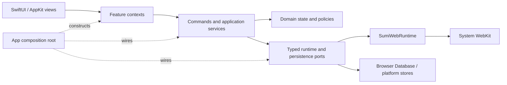

# Architecture Overview

Sumi uses a modular, state-driven architecture inspired by MVVM-C. The familiar label is only an orientation point: the load-bearing design is explicit state ownership, feature-scoped UI contexts, application services, and typed ports around WebKit and persistence.

The architecture is shaped by a browser-specific constraint: a durable page is not the same thing as a physical `WKWebView`. A page can be unloaded, restored, or presented through a separate window residence while its browser identity remains stable.

## System Map



- `SumiDomain` contains Foundation-only values and policies.
- `SumiWebRuntime` owns WebKit session, navigation, and physical residence mechanics without SwiftUI.
- The app target composes the process, browser state, feature contexts, services, persistence, and native UI.
- System WebKit remains the browser engine; Sumi owns the application layer around it.

The detailed runtime invariants live in [architecture.md](architecture.md).

## Native Utility Surfaces

History and bookmarks are browser-owned native surfaces. They keep browser-tab
identity so sidebar selection, open-in-tab commands, and profile context remain
consistent, but their large collections are rendered by reusable AppKit table
and outline cells rather than WebKit documents.

Settings is process UI, not page identity. The SwiftUI `Settings` scene owns a
single macOS window; its AppKit split view owns the sidebar, titlebar integration,
and native table controls. Settings navigation is transient window state and is
not represented by a `Tab`, `SumiSurface`, WebView residence, or session URL.
Restore admission removes legacy `sumi://settings` tab records so an upgrade
cannot materialize the retired surface as a web page.

## Sidebar selection visibility

Sidebar selection autofocus keeps semantic selection separate from AppKit
scroll geometry. The owner retains selection intent until native geometry can
execute it, then verifies the landing while lazy content grows. Resize and
fullscreen corrections reuse the same intent with instant motion. See
[sidebar selection autofocus](architecture/sidebar-selection-autofocus.md) for
the state-machine contract and scenario matrix.

## A UI Action Through the System

Opening a page illustrates the normal direction of dependencies:

1. A view sends an intent through its feature context. It does not reach for `BrowserManager`.
2. A command or application service validates the window, profile, Space, and destination.
3. Domain state accepts the durable page identity and placement.
4. A typed runtime port materializes or reuses the correct WebView residence.
5. WebKit callbacks are admitted only while their physical identity and navigation revision are still current.
6. Persistence receives value snapshots, never live AppKit or WebKit objects.

This keeps UI observation narrow and prevents a delayed callback from an old WebView from mutating the current page.

## Session Restoration

Restoration crosses a value boundary:

1. The browser database returns durable profiles, spaces, launchers, tabs, and window snapshots.
2. Restore services validate and repair those values before publishing them.
3. Window state is reconstructed before the SwiftUI shell mounts.
4. WebViews are materialized on demand; a restored page identity does not imply an eagerly created WebView.
5. Runtime-only receipts, leases, tasks, delegates, and WebKit objects are created fresh.

The result is a restored browser model rather than a serialized object graph.

## Sources of Truth

| Concern | Authority |
| --- | --- |
| Structured browser data | The Browser Database and its transactional repositories |
| Website data | The profile's `WKWebsiteDataStore` |
| Window session values | `BrowserWindowState` and its narrow child state owners |
| Physical WebView placement | `WebViewSessionRepository` in `SumiWebRuntime` |
| Extension runtime for regular profiles | Profile-scoped; private partitions always have separate non-persistent contexts |
| UI projection | Feature contexts derived from the authorities above |

Indexes, caches, diagnostics, and snapshots are projections. They may accelerate or explain a decision, but they do not become a second owner.

## Role Vocabulary

Use the smallest role that describes the responsibility. Existing generic `*Owner` names are legacy debt, not a template for new types.

| Role | Use it for |
| --- | --- |
| State | Observable mutable truth with one explicit owner |
| Context | The narrow state and commands exposed to one UI feature |
| Commands | User-initiated operations available to a context or native command surface |
| Service | One cohesive application operation that coordinates domain and runtime work |
| Repository | Canonical ownership of a collection or persistence/runtime store |
| Transaction | A multi-step change with an atomic result, rollback, or durable recovery contract |
| Coordinator | Lifecycle and ordering across several participants |
| Port | A typed boundary to WebKit, AppKit, persistence, or another subsystem |
| Ledger | Durable or runtime evidence that an intent/effect was accepted exactly once |
| Authority | The sole source allowed to decide one fact |

Do not add a synonym merely to avoid an existing name. A new role should explain a distinct invariant or remove a dependency from a broader type.

## Adding a Feature

A feature normally starts with only the pieces it needs:

```text
FeatureView.swift       # rendering and user intents
FeatureContext.swift    # narrow UI-facing state and commands, when needed
FeatureState.swift      # feature-owned observable truth, when needed
FeatureService.swift    # multi-owner application logic, when needed
FeatureTests.swift
```

Before adding a layer, answer:

- Who owns the mutable truth?
- Can the view depend on a narrower context instead of a global manager?
- Is this domain policy, application coordination, or WebKit/AppKit mechanics?
- What does the type prevent that a direct call would not?
- Does the disabled feature remain free of observers, timers, polling, and eager caches?

For the reasoning behind the most unusual seams, read the [architecture case studies](architecture/case-studies.md).
