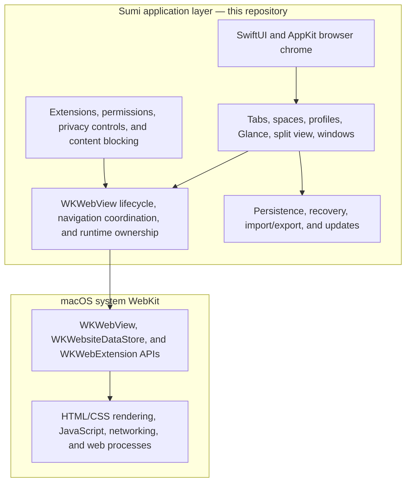

# Architecture

Sumi Browser is a native macOS app built around system WebKit, SwiftUI, and
AppKit where platform integration requires it. The repository name emphasizes
the WebKit direction, but the public product name is Sumi Browser.

The current target is macOS 15.5+.

For the module map, state flow, source-of-truth table, and role vocabulary,
start with [Architecture Overview](architecture-overview.md). This document is
the maintainer reference for exact runtime invariants.

## Module Graph

The repository keeps only two package boundaries with independent tests and
meaningful reuse constraints:

```
SumiDomain
SumiWebRuntime

Sumi App ──► SumiDomain
         └─► SumiWebRuntime
```

- **SumiDomain** — Foundation-only models and policies.
- **SumiWebRuntime** — WebKit session / navigation runtime (no SwiftUI).
- **Sumi App** — process composition, browser-runtime ports and events, shell
  UI, layout tokens, hubs, and command routing.

## System Boundary

Sumi is the native browser application layer around system WebKit. It is not a
fork of WebKit and does not contain an HTML/CSS renderer, JavaScript engine, or
network stack.



The boundary is behavioral as well as structural:

- Sumi decides when and where a `WKWebView` exists, which browser object owns
  it, which product navigation intent is current, and when browser state is
  persisted or restored.
- Sumi selects and configures WebKit data stores, policies, delegates, user
  scripts, content rules, and extension surfaces.
- WebKit implements page loading, rendering, JavaScript, networking, website
  data internals, web processes, and the underlying web-extension runtime.
- Sumi may isolate or fail closed around WebKit callbacks, but it does not
  replace WebKit's engine or process security model.

The remaining sections are an implementation deep dive into how Sumi keeps
its side of that boundary consistent.

## Repository Boundaries

Browser shell UI, its layout tokens, and the tab-structure event bus remain in
the app target because they have no independent consumer or lifecycle. A
package is not used merely to split a handful of source files: source folders
and narrow app-internal types carry those responsibilities without adding a
manifest, product, dependency edge, or duplicate test lane.

Living hub-risk metrics and semantic boundaries are checked independently by
`scripts/check_architecture_structural_metrics.sh` and
`scripts/check_architecture_structural_boundaries.sh`. Historical surfaces are
kept separately in `scripts/check_architecture_tombstones.sh`.
Generic `*Owner` names in existing code are legacy architecture debt, not the
preferred decomposition model. New extraction names the concrete role or
transaction it owns; touched god objects are split by cohesive responsibility
instead of gaining another generic owner wrapper. Runtime ports live under
`Sumi/BrowserRuntime/` in the app target, including the UUID-only split
coordination port.

## Startup Admission and Runtime Cost

Startup admission is a synchronous read-only decision over the already-open
browser database. A launch enters recovery only when the profile-retirement
ledger or import journal contains durable pending work. The common empty-ledger
path starts the browser directly and never mounts recovery UI.

Completed profile-retirement tombstones are protective history, not pending
recovery. Admission publishes the browser immediately and passes the exact
completed records to a one-shot post-mount rehydration task. That task seeds
runtime denial state without rescanning or claiming newer retirement work, so
completed history never creates an intermediate launch window.

`BrowserRuntimeLifecycle` is passive until admission explicitly prepares it
for recovery or starts it for ordinary use. Recovery preparation attaches the
ports required by durable cleanup but does not start permission, retention, or
startup observers. A normal start attaches those ports once and starts the
observers once.

History cleanup and visited-link preload, bookmark favicon synchronization,
and import-staging orphan cleanup begin after the first browser paint. Boost
data has one demand path and reads its store only when an enabled Boost feature
queries it. These maintenance paths have no launch-time timer, observer, cache,
or filesystem scan before they are admitted.

## Window State Ownership

`BrowserWindowState` owns the mutable session values that can be projected into
`WindowSessionSnapshot`. The snapshot is the only value that crosses the
persistence boundary; AppKit objects and restore receipts never enter it. The
command-palette presentation reason remains durable because it is restoration
intent, while the physical visibility of the bar is not.

Attached-shell state is split into exact, independently observable authorities:

- `WindowPresentationState` owns runtime-only chrome and AppKit facts: popover
  and command-palette visibility, URL-bar geometry, native display mode, and a
  deferred split-focus request.
- `WindowRestorationState` owns one restore cycle's archived-window identity,
  initial-resolution gate, typed pending split selection, and decode-only legacy
  migration evidence.

These authorities are passive main-actor storage. Constructing a browser window
does not start observation, scheduling, timers, tasks, caches, or AppKit work.
Their separate observation registrars also prevent transient presentation from
invalidating consumers that read only durable selection, and vice versa.
The initial window is constructed and receives its durable session projection
before SwiftUI mounts it. Registry admission then completes runtime-only
selection, Glance, and publication work; persisted sidebar and theme fields do
not arrive as a second visible correction.

## Window View Context Boundaries

`WindowView` receives seven stable feature contexts: web content, sidebar,
command palette, native modal, find, split, and theme/window chrome. There is no
all-feature window context and the view layer cannot name `BrowserManager`.
The app composition root constructs each context once and injects exact
services such as the window-tab query, split services, native-dialog owner,
space state, and theme editor. Contexts do not rediscover those services on
each SwiftUI body evaluation. The sidebar boundary retains its existing
role-specific projections and commands; it is not a replacement service
locator for unrelated window features.

Sidebar rendering observes those roles at the narrowest consumer. Typed
`TabStructureChangeScope` events identify affected window, Space, and profile
pages; unrelated pages are filtered before their snapshot builders run. Every
scoped reader subscribes at activation before taking its fresh demand-time
snapshot. Delivery is scheduled on the main run loop, so the fresh read lands
first and an exact mutation queued during that read wins afterward without a
read-to-subscribe gap. Profile collection
and profile-transition snapshots remain independent streams. Live Folder
mutations publish exact folder IDs instead of remapping global dictionaries,
and toolbar layout changes use a dedicated leaf publisher rather than
`objectWillChange`. URL-bar and AppKit-hosted Hub extension projections
subscribe only while their surface is mounted and the extension module is
enabled. Pin, unpin, toolbar reorder, and Hub reorder commands carry that
rendered profile through persistence and publish the same exact profile key;
they never fall back to the manager's concurrently current profile. A live
shortcut registry entry likewise retains an immutable presentation-page
receipt captured from its launcher container. Essential execution keeps its
nil Space, and account-fork execution may use another profile, without either
mutable execution value changing register, identity-rekey, or retirement
invalidation. A caller without an exact mounted container cannot create the
live residence. Moving an existing residence to another presented page is a
separate transaction: it carries an explicit target receipt and atomically
invalidates both the retained source and target pages. Updater and now-playing
models are likewise observed only by mounted leaf chrome. A hidden
prewarmed sidebar installs none of these subscriptions. There is no
BrowserManager structural revision, sidebar-wide relay, or discard-read
invalidation counter.

## WebView Session Ownership

The navigation, materialization, restore, recovery, and teardown contract is
summarized in [Page runtime lifecycle](architecture/page-runtime-lifecycle.md).

`SumiApp` creates exactly one `WebViewSessionRepository` for a browser process.
The composition root passes it to `BrowserManager`, `TabManager`, and the
browser's `WebViewRuntimeGraph`; production tabs are created by `TabFactory` on that same
repository. Runtime code validates repository identity and never migrates
ownership between repositories.

The repository is the placement source of truth:

- `WebViewSessionHandle` exposes one tab's detached/parked state and reads.
- Window-slot mutations are package-scoped behind
  `WebViewTrackingLifecycleOwner`, keeping index changes and lifecycle side
  effects inseparable.
- A concrete `WKWebView` has one residence: parked, untracked, one
  `(tab, window)` slot, or an exclusive pending-cleanup lease.
- Whole live-window rebuilds create the complete provisional set, then use one
  snapshot/revision compare-and-swap commit before cleaning the old set.
- Revision tracking rejects absent/present/absent ABA transactions without
  retaining closed-tab UUID tombstones.
- Replacing or releasing a detached/parked view atomically transfers the
  displaced residence into `pendingCleanup`; there is no intermediate
  ownerless state. An exact lease is consumed immediately before shutdown, so
  a stale command cannot destroy a reused view and a leased view cannot return
  to an active slot.
- `trackedWebViews(in:)` is backed by a repository-owned
  `windowID -> Set<tabID>` identity index. The index changes in the same
  mutation as the canonical store and is checked by repository consistency
  assertions; it never becomes a second owner of `WKWebView` instances.

Protected compositor mutations use per-source, semantic-key deduplicated
commands. The buffer has a soft shedding capacity: best-effort maintenance is
dropped or displaced at the threshold, while unique destructive or explicit
navigation work may temporarily exceed it rather than be lost. Deferred
commands use directional effect dominance only when the newer operation is
proven to perform every effect of the older command for the same exact scope;
window, tab, detached-cleanup, and WebKit-close effects are never conflated.
Superseded commands are reported to the normal drop/diagnostic path, and a
failed command is not restored in front of a newer proven dominator. Deferred
navigation rebuilds resolve and retain their target, configuration, semantic
kind, and monotonic intent revision before deferral; maintenance rebuilds
cannot replace pending semantic navigation, and stale intents are rejected.
Cross-window URL propagation uses the same rule: each protected tracked view
receives a guaranteed, latest-wins command keyed by its concrete WebView and
validated against both its exact `(tab, window)` owner and the originating
navigation revision. Releasing protection replays the current command; a newer
navigation or residence change prunes it. Each participating WebView has one
explicit delivery phase (`preparing`, `deferred`, `submitted`, `active`, or
`completed`), so readiness, protection replay, and direct submission compete
through one state transition instead of independent booleans. A nil WebKit
submission restores a protected delivery to `deferred`; it is never consumed
as success. Views already awaiting their own initial/explicit load are
excluded from broadcast, preventing a readiness race from loading the same
document twice.
The final protection check, queue removal, and command execution are one
contiguous main-actor operation. Re-protection therefore leaves the command
queued instead of executing it through a check/use gap. When global teardown
removes compositor protection, every command it makes executable is explicitly
flushed. A failed guaranteed execution is restored to its FIFO position and
retried with capped exponential backoff until it succeeds, becomes invalid, or
the terminal browser-session reset cancels it; it is never consumed as success
or stranded after a retry budget.

Promoted Glance hosts use a typed handoff state machine. Registration requires
a live compositor container; successful take/attach resolves `.attached`,
while replacement or window/global teardown resolves `.cancelled` exactly once.
Each compositor installation also owns an identity lease. A stale controller
cannot unregister a replacement container or run window-global fullscreen,
handoff, or host teardown for the replacement. Every queued display, host,
focus, hover, repair, and delayed visual mutation revalidates that exact lease
before touching AppKit state, so a superseded controller cannot reparent the
canonical WebView into its obsolete hierarchy. Visual-handoff protection is
itself an exact lease, not a boolean, and only its owner can release it.
History-swipe transactions likewise retain the exact source WebView across
primary-window changes; cancellation, timeout, overlap, and regular-navigation
settlement release that source rather than whichever clone is currently
primary.

Initial-document handoff captures both a semantic navigation intent
`{revision, targetURL}` and the exact repository residence of its `WKWebView`.
After every suspension, and immediately before loading, both must still match.
The readiness ticket owns the revision, while the load resolves the latest
target for that revision after the gate; an accepted redirect therefore moves
a waiting sibling to the redirect target without admitting a second load.
Thus a delayed initial load cannot overwrite newer navigation or follow the
same view after it has moved to another window. `stopLoading` invalidates the
semantic intent as well as the WebKit transaction, and initial handoff supports
file URLs through `loadFileURL` rather than treating HTTP as the only initial
document class.

Main-frame model mutation is authorized by the exact
`ObjectIdentifier(BrowserServicesKit.Navigation)`, pre-bound to every
browser-owned `WKNavigation` through `ExpectedNavigation`. One WebView is the
authority for a semantic revision; sibling callbacks remain participants but
cannot mutate shared `Tab` state. Trusted client-redirect and same-document
continuations may transfer that authority only on the same WebView and within
the same still-current revision. User supersession requires WebKit's explicit
user-initiation signal. When an authoritative WebView leaves the runtime,
authority is promoted to an already-active sibling before delegates are
removed. Completed identities are discarded, preventing allocator-address ABA
from reviving an old transaction. `Tab.url` is presentation/persistence state,
not navigation identity; only command and accepted lifecycle APIs advance the
semantic intent. URL comparisons use one canonical identity for default ports,
empty HTTP paths, file paths, and percent escapes.

`Tab` retains one main-frame runtime aggregate and cannot retain its mutable
components separately. The intent ledger owns semantic submissions and
deferred loads; the lifecycle machine coordinates exact physical participants,
logical authority, and one-shot effect claims; the committed-document ledger
is the durable rollback source even after every physical replica disappears;
and the WebContent recovery planner owns exact per-WebView recovery markers.
Transitions that cross those boundaries run through the aggregate on the main
actor. This prevents a physical clone, a pending submission, or a process-crash
retry from silently becoming navigation authority by mutating only one store.
The ownership guard rejects production construction of those components
outside the aggregate and rejects direct component storage on `Tab`.

Pointer, gesture, and short-lived permission evidence belong to the physical
`FocusableWKWebView`, not to the logical `Tab`. Each view keeps separate value
snapshots for modifiers and Glance origin, hovered-link observations,
context-menu target state, and popup user activation; no `NSEvent` or
cross-view callback is retained by `Tab`. Script handlers route through the
exact `WKScriptMessage.webView`, navigation and permission delegates consume
the exact source view, and missing physical identity fails closed for
activation-sensitive operations. A window hover session subscribes only to
its currently displayed physical hosts, supports independent split-pane
sources, and revalidates the compositor lease before delivery. Consequently a
clone in another window cannot contribute modifiers, hover URLs, menu targets,
or user activation to its sibling.

Link and Glance presentation commands also start from the exact
`FocusableWKWebView`. `TabLinkPresentationCommands` validates that view against
the canonical tracked `(tabID, windowID)` residence and resolves that specific
window before opening anything; it never asks which arbitrary window contains
the logical `Tab`. New-tab and new-window dispositions both retain their
selection flag, while an untracked or mismatched physical source fails closed.
Glance receives the resolved window explicitly, so the same logical tab shown
in two windows presents over the window where the gesture occurred. Physical
gesture state is consumed only after the command reports that this exact route
was accepted; failure continues normal WebKit event delivery and never invokes
logical-Tab activation as a fallback. When Glance requires source selection,
that selection is applied to the already-resolved physical window before the
overlay is presented.

Popup navigation is composed from explicit capabilities rather than a
per-Tab closure bag. Permission evaluation, extension-request consumption,
external extension Tab opening, auxiliary Web popup presentation, WebKit child
Tab creation, and WebKit child-window creation are injected independently into
the navigation delegate. The behavioral services resolve the exact physical
source and data-store partition and fail before structural mutation when the
source shell, extension registrar, or partition proof is unavailable. The
first Tab of a WebKit-created window is staged through the same reversible
extension-publication receipt as its window: exact Tab/WebView validation runs
before registry commit, then extension observers receive window-open before
Tab-open. A rejected or extension-originated suppressed projection rolls the
whole provisional child back. Lifecycle and Glance Tab creation reuse the
assembled runtime, so adding a Tab does not allocate another copy of these
stateless browser services.

Window-to-extension publication is one process-wide transaction, exposed
explicitly by the browser composition root rather than hidden in the session
persistence bundle. Session restoration, WebKit child windows, link-created
windows, and extension-requested windows all use that same ledger. Repeated
prepare calls are idempotent while an exact window is pending, committing, or
committed; registry repair revokes the exact initial-Tab receipt before its
window receipt. Publication and focus notification are separate capabilities,
so activation code cannot acquire the mutation side of the ledger.

## Runtime Assembly

`BrowserManager` owns one `WebViewRuntimeGraph`, constructed directly by its
root-only WebView runtime composition extension from the canonical
`WebViewSessionRepository`. There is no manager-taking factory. Construction
supplies exact inputs: the runtime-tab resolver, collection-tab resolver,
`WebViewWindowServices`, `DeferredWebViewServices`,
`WebViewVisibleRuntimeContext`, and `InitialDocumentWebViewRuntimeContext`.
The graph composes concrete services; it has no service locator, late-binding
context store, observation, or SwiftUI environment role. Feature code receives
concrete runtime services instead of the graph. Protected-command admission,
processing/retry, and terminal execution are separate roles, and their live
composition cannot reach back through `BrowserManager`, the graph, or lifecycle.

Selected-profile state has one mutable owner,
`BrowserCurrentProfileAuthority`. `BrowserManager.currentProfile` is only the
composition-root compatibility write surface and forwards into that authority;
it is not a second store. Feature graphs that need profile selection capture the
authority directly, including its publisher, instead of retaining or weakly
re-entering the complete `BrowserManager` graph. The authority exposes no public
mutation surface of its own.

The Tab profile-query port is assembled once from that profile authority,
`ProfileManager`, and the settings-attachment coordinator. Settings remain a
weak, replaceable app-shell binding, but the late binding is owned by the exact
coordinator rather than discovered by re-entering `BrowserManager` for every
query. Profile transactions therefore reuse immutable collaborators instead of
rebuilding dependencies on demand.

The Tab session-side-effects port likewise retains the process's concrete
recently-closed store, notification presenter, WebView close router, and Live
Folders service. The recently-closed store is immutable in the process graph;
tests no longer replace it after runtime-port assembly. Calls through this port
therefore cannot switch to a different service through a later root lookup.

There is no browser-wide WebView runtime context and no attach/detach lifecycle.
Window lookup and compositor effects come from the exact window capability;
protected-command replay uses the exact deferred capability; visible
preparation, initial-document loading, and shutdown each receive their own
immutable context. Terminal lifecycle cleanup explicitly resets the replacement
pipeline, whose reset reaches its settlement service, before the remaining
WebView runtime state is drained.

`TabManager` side effects use immutable typed ports. The live ports share one
explicit browser-session lifetime reference: using a port after the owning
session is released is a composition failure, not a silent no-op. No-op port
registries exist only in test support. Persisted tab restore starts only after
runtime ports, the window registry, and the immutable WebView runtime graph are
constructed;
it compares a structural mutation revision across its asynchronous load and
rejects stale snapshots instead of overwriting live changes. Initial-data
readiness is replayed to late subscribers.

## Browser Shell

The main browser shell is organized around:

- Tabs for ordinary page navigation.
- Spaces for separating groups of tabs within a profile.
- Profiles for separating larger browsing contexts.
- Sidebar-first organization for tabs, spaces, pinned items, essentials, and
  folders.
- Glance for opening a page over the current tab without taking layout space.
- Split view for viewing up to four pages together.
- Command palette for search, address entry, suggestions, site search, history,
  bookmarks, and split-aware actions.

Glance can close quickly, expand into a normal tab, or move into split view.
Pinned and essential items can also open through Glance-style launcher flows.

Essentials are global across spaces that belong to the same profile. Pinned
items live in one space and look like normal tabs. Essentials appear as tiles.

## Launcher Semantics

Sumi separates visible organization from live page runtime where possible.
Pinned and essential items can preserve their visible identity while the live
WebView/runtime instance is unloaded to free memory. This is a design and
implementation behavior, not a benchmark claim.

## Normal WebView Configuration Transactions

A normal WebView is provisional until its complete configuration has passed the
built-in extension preparation and still uses the exact data store of its
target profile. There is no arbitrary caller mutation hook after preparation.
Construction attaches a policy receipt bound to one Tab ledger, profile, and
WebView-session generation. `CanonicalWebViewPlacementService` carries a
one-shot admission through the exact tracked or untracked repository CAS,
commits it before registration side effects, then revalidates the published
physical identity. Failed admission, mixed clone preparation, stale
replacement, and settlement rollback cancel the receipt without publishing
policy state. Raw normal WebViews without a receipt are rejected. Auxiliary
WebViews use separate tracked and untracked placement capabilities and cannot
join a normal clone generation.

The ledger records the configuration-time plan, not a fictional snapshot of
asynchronous WebKit rule-list lookup. Clone compatibility compares only the
effective configuration fingerprint (profile, data-store identity, rule-list
identities, and autoplay policy), while site metadata remains diagnostic.
Actual post-lookup and hot-swap rule lists are read from the normal-tab user
content controller diagnostics. Whole detached generations are replaced by
`DetachedWebViewReplacementService` through the same shared settlement
pipeline as tracked rebuilds. Replacement settlement commits the new plan
after the repository CAS and before retirement of the previous physical
generation; rollback cancels pending receipts instead of restoring mutable
policy snapshots. Detached release transfers residence to an exact cleanup
lease before immediate or protection-deferred physical destruction.

Reload requirements are held by independent Safari blocker, protection, and
autoplay states. They read narrow typed policy capabilities and may request the
shared exact-Tab replacement service; there is no browser-root reload runtime,
aggregate mutable state owner, or closure-based replacement context.

## Performance Principles

Sumi is performance-first in the sense that browser features should have clear
lifecycle ownership and should avoid hidden work.

Current principles:

- Use system WebKit for page rendering.
- Prefer native SwiftUI/AppKit browser chrome over heavy web UI.
- Keep optional modules lazy.
- Disabled modules should not create background runtime work.
- Avoid background services and timers unless they are necessary.
- Preserve visible tab, pinned, essential, and folder organization when
  inactive live page runtimes are unloaded.
- Keep extension service-worker behavior aligned with Safari's event-driven model.
- Index identity and ordering lookups on restore/selection hot paths instead of
  repeatedly scanning tab, pin, folder, or WebView collections.

Memory modes exist in the UI, and inactive tab unloading exists. The goal is to
preserve user organization while reducing unnecessary live runtime state.

## Optional Modules

Extensions, Live Folders, Boosts, and privacy cleanup are feature areas that
remain optional. When disabled, they should avoid background runtime cost.

## Protection

Tracking Protection and Adblock are owned by the native content-blocking
runtime under `Sumi/ContentBlocking`. Sumi consumes prepared bundles from
`sumi-protection-bundles`, verifies their manifests and shard hashes, compiles
the selected groups through WebKit, and keeps the previous generation available
for rollback. The browser must not fetch raw filter lists, parse ABP/uBO syntax,
run `adblock-rust`, or convert DuckDuckGo Tracker Radar data at runtime.
The bundle format is defined in
[Sumi Native Rule Bundle v1](adblock-native-rule-bundle-v1.md).

## Extensions

Safari extension support is built around `WKWebExtensions`. Release claims are
extension- and workflow-specific; the current matrix is maintained in
[Extension Compatibility](extensions.md).

Normal browsing views are the default extension participation surface. Helper
surfaces such as favicon downloads, previews, and mini windows should not
participate implicitly. An extension-created auxiliary window opts in through
its own two-phase Tab+Window transaction. A silent Tab prepublication receipt
first proves the exact auxiliary Tab, physical WebView, owner extension
context, profile controller, and profile data store. The window ledger then
publishes `didOpenWindow` to that owner context, revalidates, commits the exact
owner-context `didOpenTab`, revalidates again, and only then permits focus. No
controller-wide Tab callback is used, so an unrelated extension in the same
profile cannot observe or operate the auxiliary Tab adapter.

Close tombstones the ledger before entering WebKit, balances the captured Tab
with `windowIsClosing: true`, and then balances its captured Window. A receipt
that never reached Tab commit is cancelled without a Tab-close callback.
Runtime reload suspends this exact pair before generic normal-Tab retirement
and republishes the still-live native session into the new generation; terminal
runtime teardown closes it once before later native-session cleanup. Stable
adapters survive reload, while rejected and terminal transactions remove only
their exact adapter identities. Focus may return to a normal window only
through that window's already-published profile projection. Read-only window
queries use the same ledgers, put the exact focused committed auxiliary session
first, and otherwise use stable UUID order. If any exact proof changes during a
synchronous callback, presentation is rejected and the native session is torn
down rather than exposing a partial graph.

An extension action popup keeps the exact click-time window, tab, profile, and
WebKit data-store receipt for its lifetime. Nested `window.open` requests must
revalidate that receipt and fail closed; they must never rediscover an opener
through whichever browser window happens to be active later.
