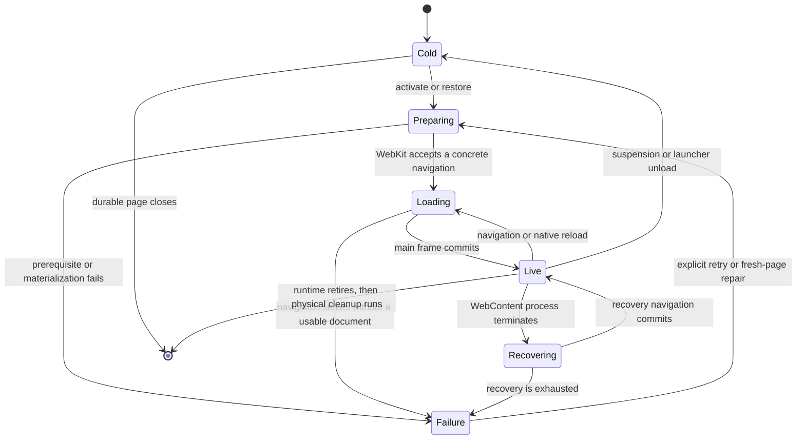

# Page runtime lifecycle

This document is the contract between durable browser state and a live
`WKWebView`. It is intentionally about ownership and terminal behavior, not a
catalog of every callback.

## Model

A page has two different lifetimes:

- **Durable page identity** is the `Tab` and its persisted browser state. It
  survives suspension, window-residence changes, WebContent termination, and
  replacement of a physical WebView.
- **Live page generation** is one configured `WKWebView`, its delegates,
  user-content controller, navigation participants, and exact residence in the
  session repository. A retired generation cannot mutate the durable page.

One logical page may have more than one live window residence. Object identity,
window identity, residence generation, and navigation revision therefore travel
with work that can outlive the call that created it.

## Lifecycle

## Navigation authority

`TabMainFrameIntentLedger` and `TabMainFrameRuntimeTransaction` own the browser
attempt before submission. Submission transfers one exact participant into the
WebKit navigation lifecycle. `TabMainFrameLifecycleMachine` admits callbacks and
rejects evidence from stale revisions, departed WebViews, and retired
generations.

The durable destination changes only when the main frame commits. A provisional
request may update loading presentation, but it does not replace the last
committed URL or discard the previous committed frame. Finish and failure settle
the accepted attempt once; they do not become a second URL authority.

Browser-owned prerequisites may delay submission only when correctness requires
them. Their owners must settle with a typed outcome and must be cancelled when
the generation retires. Optional extension and native-messaging warmup is not a
first-document gate.

Reload, stop, back, and forward use WebKit's native navigation model. A command
is successful only when it binds a concrete navigation or an exact already-owned
attempt; reporting "scheduled" without either witness is not success.

## Materialization and presentation

Activation creates a window-scoped `PageMaterializationRequest`. Requests are
latest-wins and carry the page, destination, window, and residence generation.
Host lookup and SwiftUI/AppKit presentation are projections of that state; they
never initiate navigation as a side effect.

`PagePresentation` keeps non-live states distinct for host planning:

- loading with the intended destination;
- prerequisite or restore failure;
- WebContent recovery failure;
- website-data clearing;
- browser-owned surface, empty state, or live content.

Loading, cleanup, restore, preparation, and integrity states use a neutral
surface with no browser-internal status text. Only recovery failure exposes
repair actions, matching the error-page role in other WebKit browsers. Retrying
it starts a new exact materialization request.

## Restore and `about:blank`

Session restore is data-first. Durable URL and structural state are restored
without eagerly creating WebViews; native `interactionState` is an optional
in-process resume aid, not durable truth. Once initial data and window state are
reconciled, the final visible selection re-enters the ordinary activation path;
that event creates its exact materialization request and starts the first
navigation. Background restored pages remain cold until selected.

`about:blank` is accepted as page content only with `BlankDocumentAdmission`
from an explicit user command, site navigation, popup, history entry, or native
session snapshot. Initial WebKit blank state and website-data-cleanup transport
are not durable destinations. Corrupt restore data produces restore failure
instead of silently changing the page to `about:blank`.

## Process recovery

WebContent termination is event-driven. One committed-document lineage receives
one automatic recovery attempt. A background residence may wait for activation;
an active residence binds an exact recovery navigation. A second termination or
failed delivery produces `recoveryFailure` instead of an infinite retry loop.

The automatic allowance resets only after an explicitly authorized recovery
commit. A user retry may replace an unusable live generation while preserving
the durable page identity and last committed destination. It must not pretend
that POST bodies or opaque history can be reconstructed when WebKit did not
provide a native snapshot.

## Retirement and data cleanup

Retirement is logical before physical:

1. seal the exact residence/generation against new commands;
2. settle navigation, policy, authentication, prompt, and preparation owners;
3. remove delegate and user-content participation;
4. release the residence and destroy the physical WebView.

Website-data clearing uses `about:blank` only as isolated transport while data
is deleted. Participants are exact and finite. After deletion, each page gets
one concrete restore transfer or an explicit failure; cleanup does not loop
until a page happens to load.

## Runtime cost

The lifecycle is driven by commands and WebKit/AppKit callbacks. It has no page
load watchdog, polling loop, diagnostic ring, or periodic recovery timer. A
blind timeout would turn a slow but valid page into a browser failure without
repairing a stuck browser-owned prerequisite.

## Code and tests

The central implementation is in:

- `Sumi/Models/Tab/TabMainFrame*` for attempt and callback authority;
- `Packages/SumiWebRuntime/.../Session` for physical residence ownership;
- `Sumi/Managers/BrowserManager/PageMaterializationRequestLedger.swift` and
  `BrowserTabSelectionMaterializationOwner.swift` for activation;
- `Sumi/Models/Tab/TabWebContentRecoveryMarkerLedger.swift` and
  `Sumi/Managers/WebViewRuntime/WebContentProcessRecoveryService.swift` for
  recovery;
- `Sumi/Managers/WebViewRuntime/WebsiteDataCleanup*` and
  `WebViewTabTeardownOwner` for finite cleanup and retirement.

Representative regression coverage lives in `TabMainFrameLoadRuntimeTests`,
`TabNavigationTransactionOwnerTests`, `TabStartupRestoreLifecycleTests`,
`PagePresentationStateTests`, `PageRuntimePoisonedGenerationFeedbackLoopTests`,
`WebViewTabTeardownOwnerTests`, and `WebsiteDataCleanupTransactionTests`.
